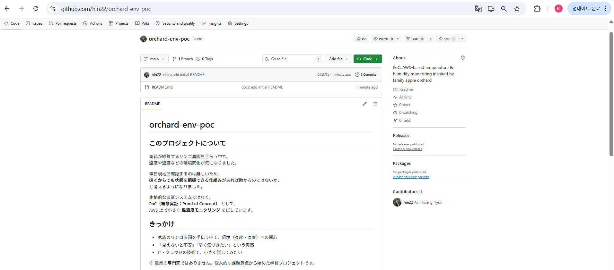
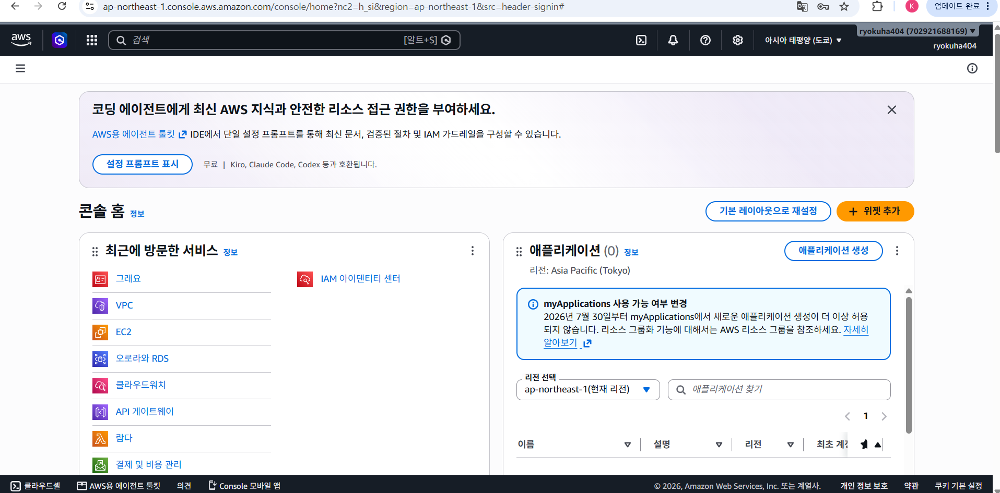
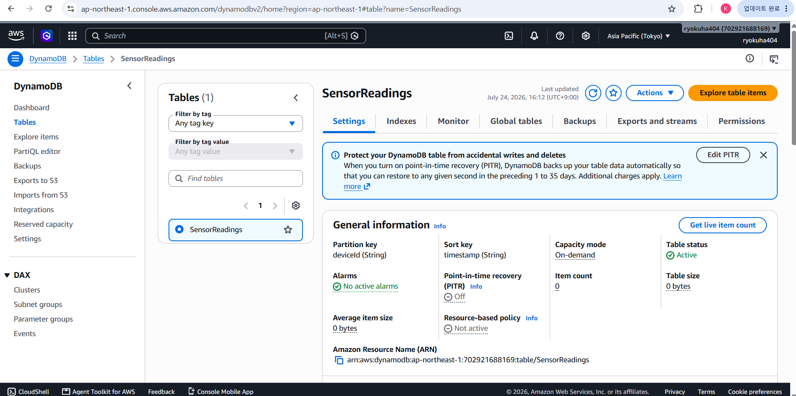
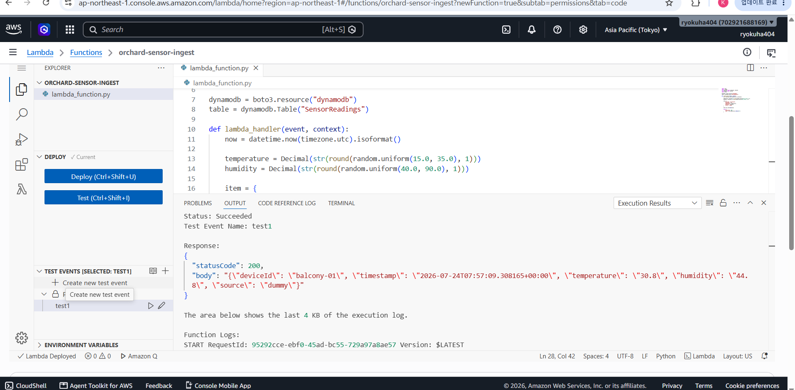
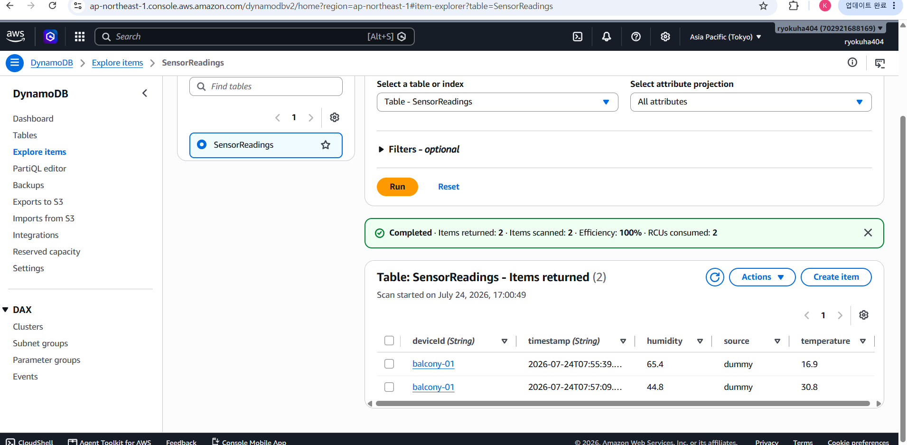
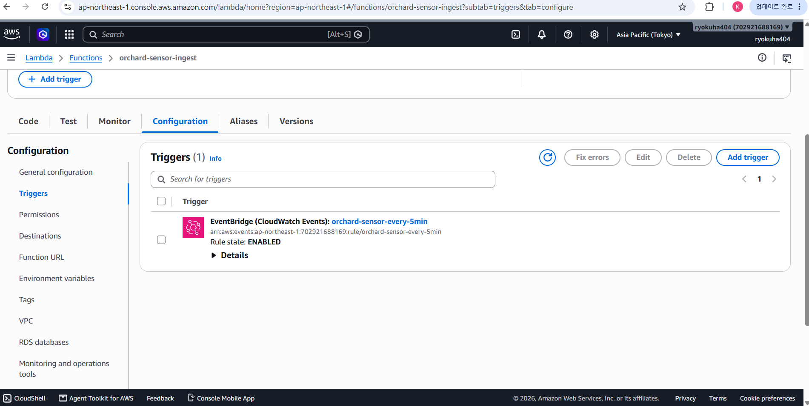
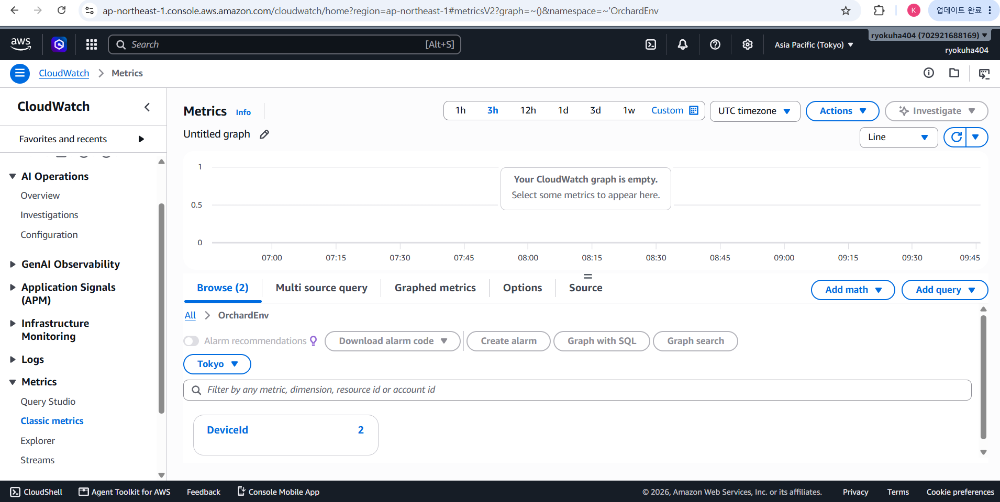
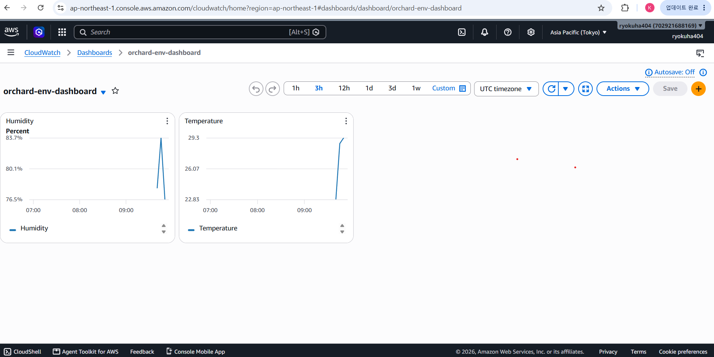
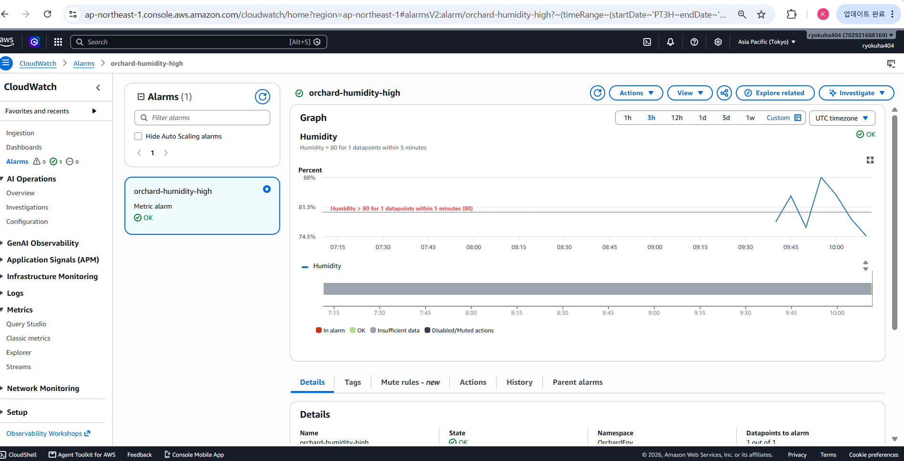
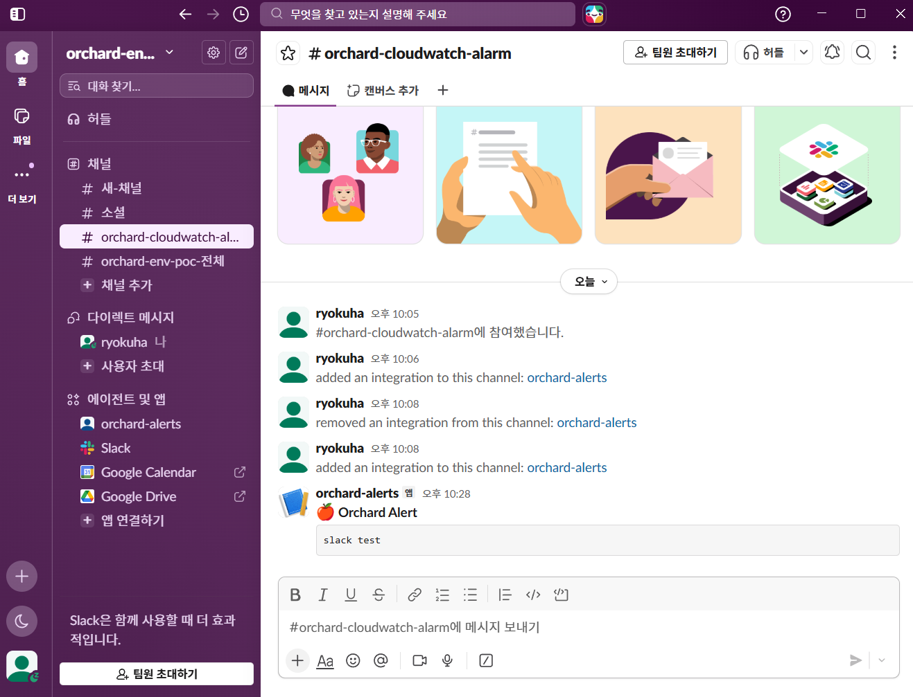

# orchard-env-poc

## このプロジェクトについて

両親が経営するリンゴ農園を手伝う中で、  
温度や湿度などの環境変化が気になりました。

毎日現地で確認するのは難しいため、  
**遠くからでも状態を把握できる仕組み**があれば助かるのではないか、  
と考えるようになりました。

本格的な農業システムではなく、  
**PoC（概念実証：Proof of Concept）** として、  
AWS 上で小さく **温湿度モニタリング** を試しています。

## きっかけ

- 家族のリンゴ農園を手伝う中で、環境（温度・湿度）への関心
- 「見えないと不安」「早く気づきたい」という実感
- IT・クラウドの技術で、小さく試してみたい

※ 農業の専門家ではありません。個人的な課題意識から始めた学習プロジェクトです。

## アーキテクチャ（Phase 1：ダミーデータ）

## 構成（Phase 2：予定）

ESP32 + DHT22 → AWS IoT Core → Phase 1 と同じパイプライン

センサー到着後、ダミーデータから **実測データ** に切り替える予定です。

## 監視項目（仮）

| 項目 | 内容 |
|------|------|
| 温度 | ℃ |
| 湿度 | % |
| アラーム | 湿度 > 80%（**検証用の仮閾値**。農業の正式基準ではありません） |

## 使用 AWS サービス

- Amazon EventBridge
- AWS Lambda（orchard-sensor-ingest / orchard-slack-notify）
- Amazon DynamoDB
- Amazon CloudWatch（Dashboard / Alarm / Metrics）
- Amazon SNS
- （Phase 2 予定）AWS IoT Core

## デモ（スクリーンショット）

### 1. GitHub リポジトリ

### 2. AWS リージョン（東京）

### 3. DynamoDB（SensorReadings）

### 4. Lambda テスト成功

### 5. DynamoDB データ確認

### 6. EventBridge トリガー

### 7. CloudWatch メトリクス

### 8. CloudWatch ダッシュボード

### 9. CloudWatch アラーム

### 10. Slack 通知

※ 画像は PC 上に保存。今後 `docs/screenshots/` に追加予定

## 進捗

- [x] Phase 1：AWS パイプライン（ダミーデータ）
- [x] CloudWatch ダッシュボード
- [x] CloudWatch アラーム
- [x] SNS → Email 通知
- [x] SNS → Slack 通知
- [ ] Phase 2：ESP32 + DHT22 連携
- [ ] 現場・ベランダでの実測データ

## JET との関連（参考）

- **01 インフラ導入**：監視基盤の構築（PoC）
- **04 運用・監視**：CloudWatch ダッシュボード + アラーム + 通知

## 今後

- ESP32 + DHT22 による実測データ連携
- 先輩のフィードバックを踏まえた改善（DB 選定、閾値など）
- AWS 資格・インフラ現場での学習
